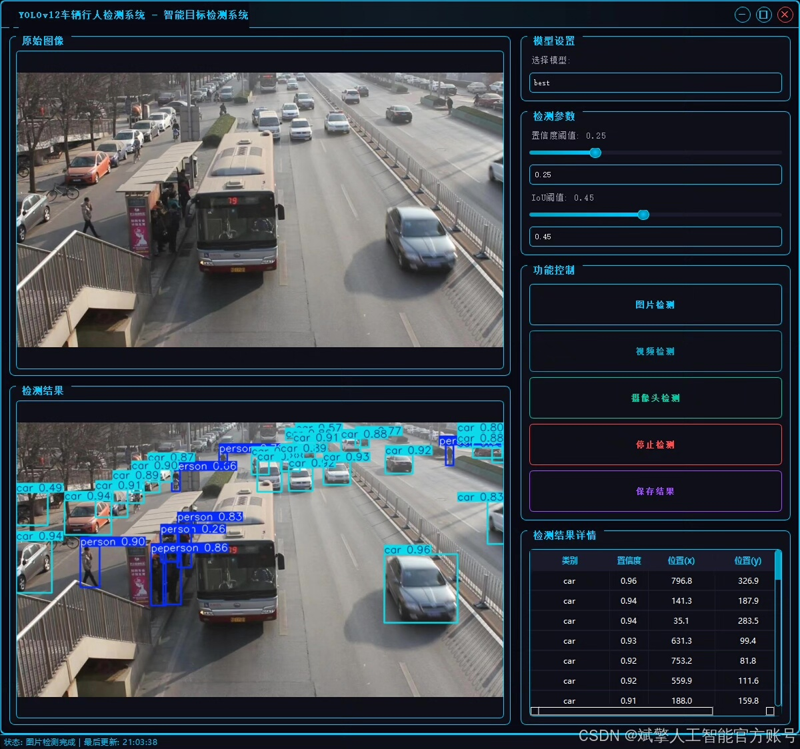
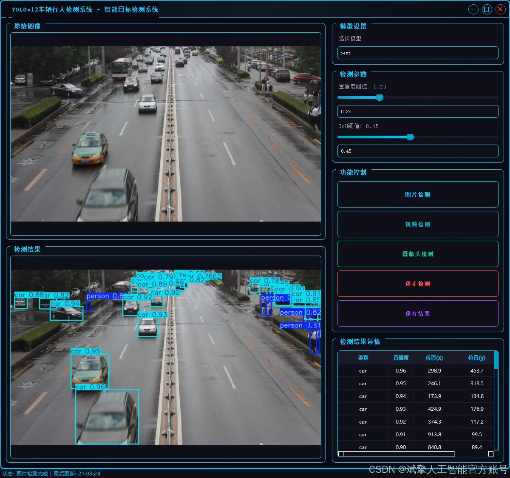
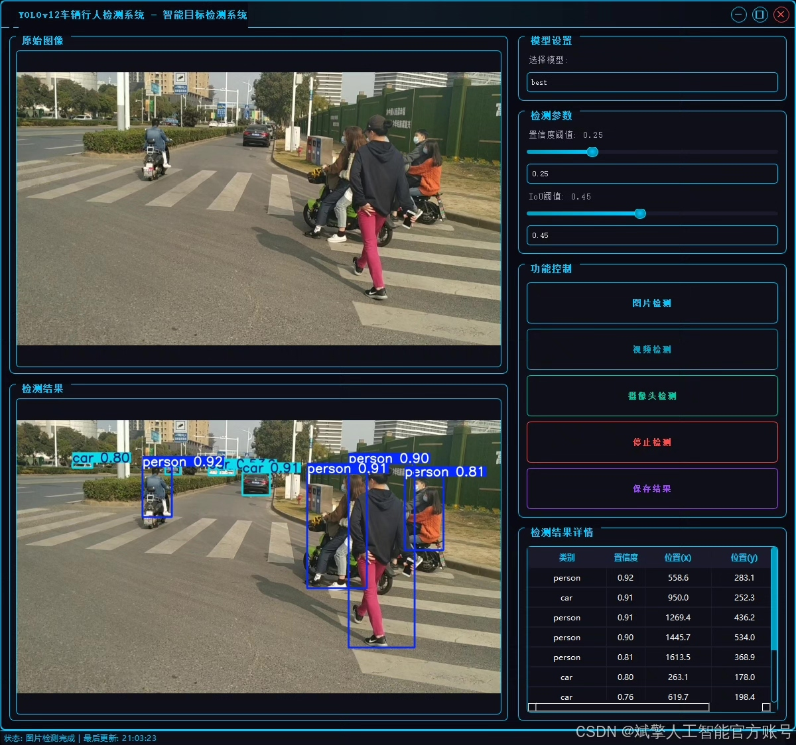
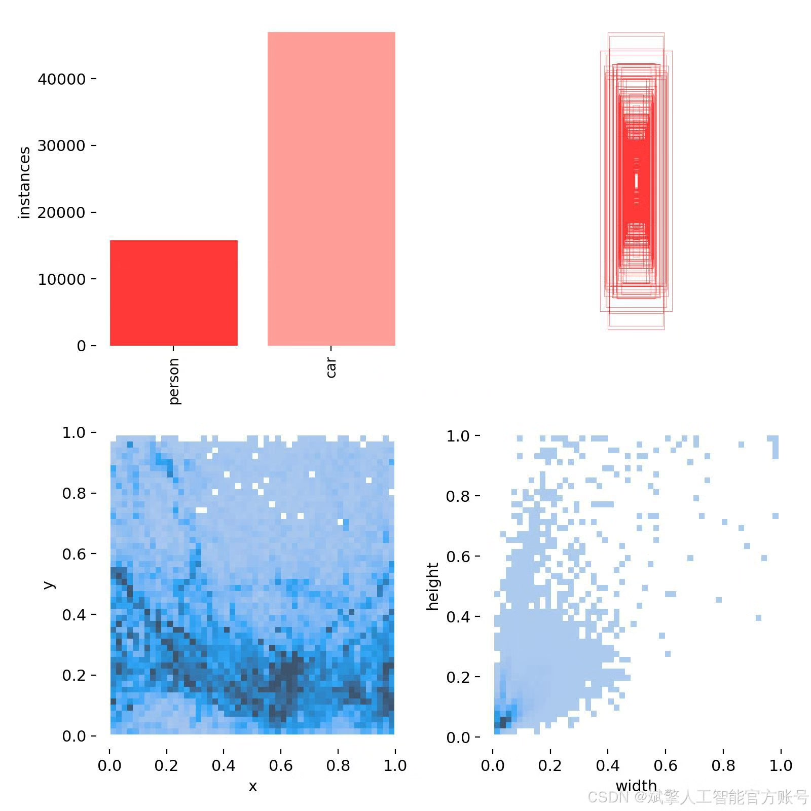
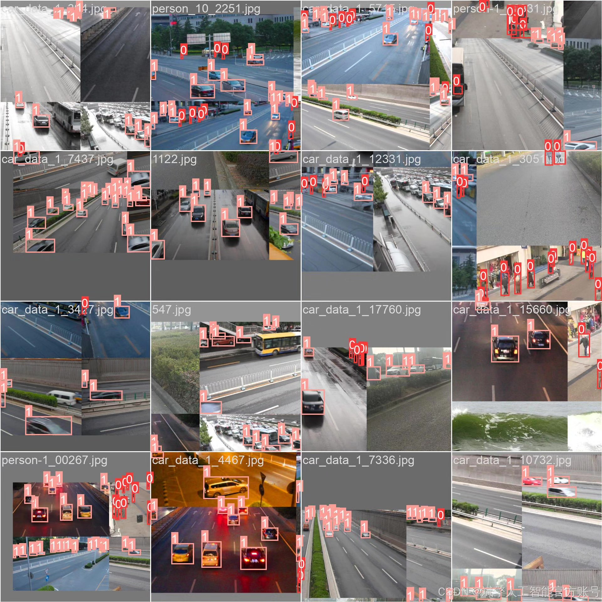
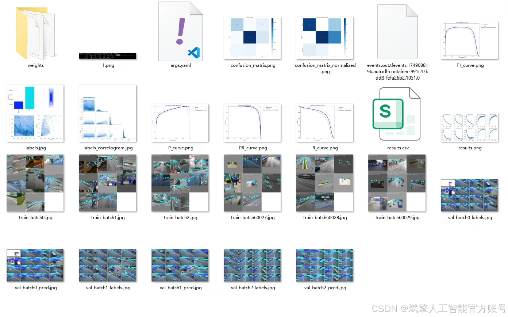
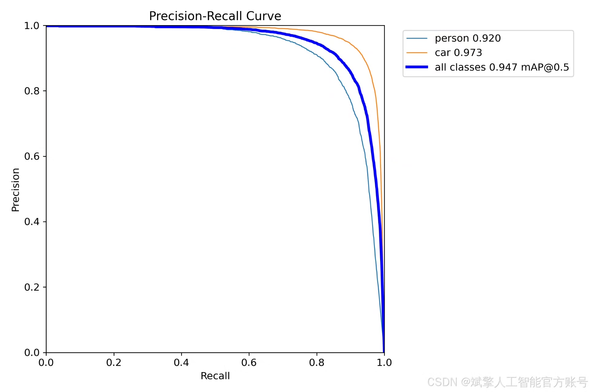
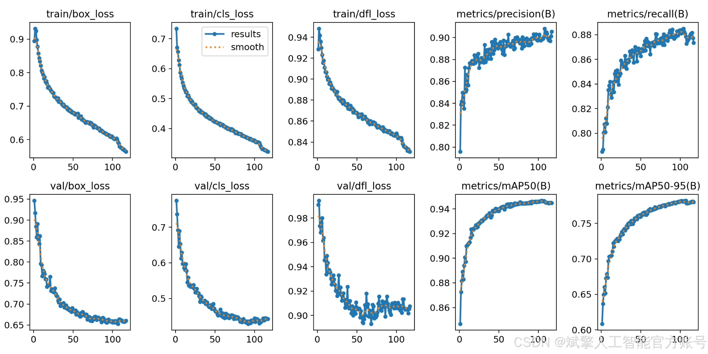
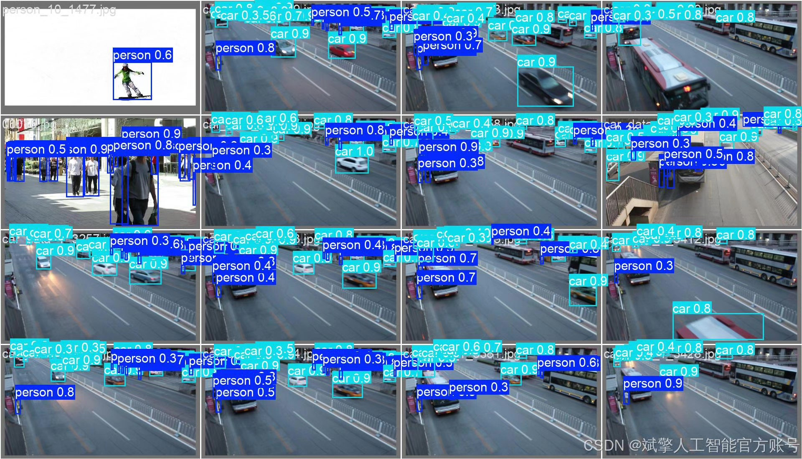

# YOLOv12 vehicle and pedestrian recognition system

## Body

YOLOv12 Vehicle and Pedestrian Recognition System Based on Deep Learning YOLOv12

This paper designs and implements a vehicle and pedestrian recognition system based on the deep learning YOLOv12. The system combines an efficient target detection algorithm with a user-friendly UI interface, capable of accurately recognizing "pedestrians" and "vehicles" in images or videos in real-time. The system utilizes the YOLOv12 model and is trained and validated on a custom dataset containing 5,607 labeled images (4,485 training images, 1,122 validation images). Additionally, the system integrates login and registration functions, along with an intuitive visualization interface. Experimental results show that the system achieves practical detection accuracy and speed, and can be widely applied in intelligent transportation and security monitoring fields. The project is fully open-source, including Python source code, pre-trained models, and datasets, providing a reproducible benchmark for related research.

✅ User Login and Registration: Supports password verification and security validation.
✅ Three Detection Modes: Based on the YOLOv12 model, supports image, video, and real-time camera detection, with precise target recognition.
✅ Dual-Screen Comparison: Displays the original scene and detection results simultaneously on the screen.
✅ Data Visualization: Real-time table displays the category, confidence, and coordinates of detected targets.
✅ Intelligent Parameter Tuning: Offers a confidence slide bar to dynamically optimize detection accuracy, adapting to different scene requirements.
✅ Sci-Fi Interactive Interface: Dark theme paired with dynamic light effects, reducing visual fatigue and enhancing operational experience.

## Images

## Payment

Here is a pay link on Stripe ( https://buy.stripe.com/3cs8yP7sY87d0vu9AB ). Please contact me lonlonago@foxmail.com after funding $89, and I will send you a complete data files , thank you!

